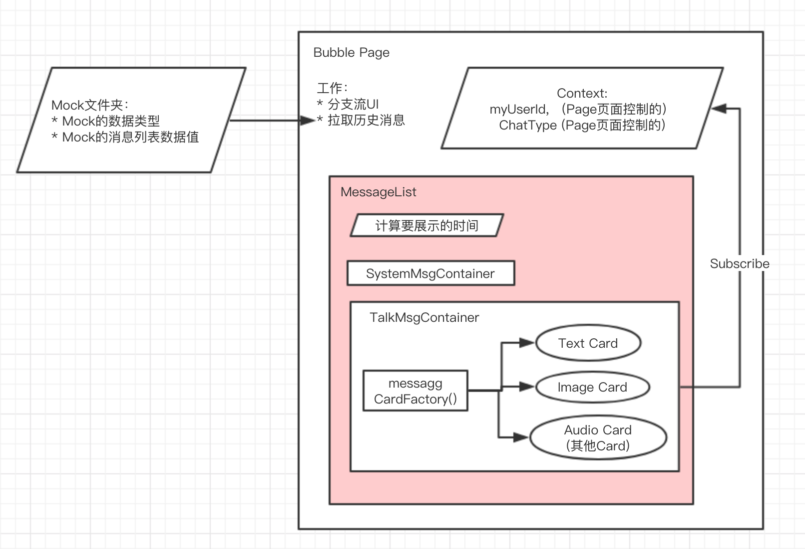

### 项目描述  
实现一个简单的微信消息流组件。只有读取，没有写入。  
项目脚手架用create-react-app简单搭建。

### 设计思路  
  

### 如何添加新类型的MessageCard?  
为保证扩展ing，只需新增，少量修改。  
1. 在TalkContainer/components中增加你的组件，比如AudioCard.
2. ChatType增加你组件的标识。
3. 在messageCardFactory.js的map中注册你的新组件。
